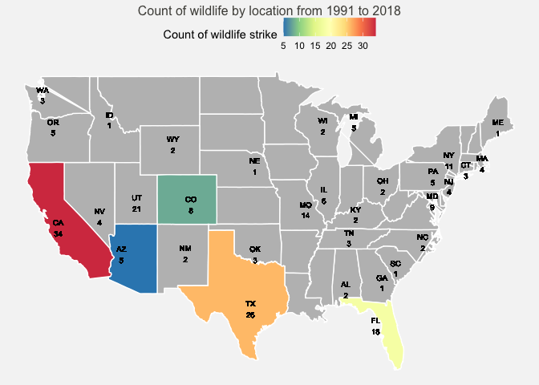

<!-- README.md is generated from README.Rmd. Please edit that file -->

# wildlifestrikes

<!-- badges: start -->
<!-- badges: end -->

## Overview

`wildlifestrikes` is a package which analyses the wildlife strikes to
aircraft in the United States from 1991 to 2018.

## Installation

You can install the development version from GitHub with:

``` r
# install.packages("devtools")
devtools::install_github("etc5523-2022/rpkg-Minminsoh")
```

## Purposes of this package

The goals of the package are to:

-   Inform users of the conditions and factors that affect the frequency
    and occurrence of wildlife strikes on aircraft
-   Analyse the number of cases of wildlife strikes on aircraft in the
    user selected states
-   Analyse the impact of wildlife strikes on airlines in terms of
    number of cases, damage levels and repair costs
-   Calculate the correlation and p-value between selected variable and
    repair cost incurred due to wildlife strikes
-   Provide an easy to use and clear platform to digest and understand
    the data using Shiny

## Usage

``` r
library(wildlifestrikes)
```

The below examples use the built-in dataset `wildlife_strikes` and
`USmap`.

The package contains the following functions:

1)  The function, `count_frequency()` calculates the frequency of the
    observations for a particular variable in the `wildlife_strikes`
    data set in a tibble format while `count_frequency_plot()` shows the
    frequency of observations in a bar plot. It is helpful in
    identifying which condition in the variable is associated with
    higher occurrence of wildlife strikes to aircrafts.

``` r
count_frequency(sky)
#> # A tibble: 3 × 2
#> # Groups:   sky [3]
#>   sky            n
#>   <chr>      <int>
#> 1 No Cloud     105
#> 2 Overcast      41
#> 3 Some Cloud    79
```

``` r
count_frequency_plot(sky)
```


2)  The function, `cases_statemap()` presents the number of wildlife
    strikes reported in the selected states from 1991 to 2018 in a
    choropleth map. Alternatively, run `cases_state()` to show the
    observations for the selected states in a tibble format.

``` r
cases_statemap(c("arizona", "california", "florida", "colorado", "texas"))
```



``` r
cases_state(c("arizona", "california", "florida", "colorado", "texas"))
#> # A tibble: 5 × 3
#> # Groups:   Abbreviation of State [5]
#>   `Abbreviation of State` `Number of cases` `Name of state`
#>   <chr>                               <int> <chr>          
#> 1 AZ                                      5 arizona        
#> 2 CA                                     34 california     
#> 3 CO                                      8 colorado       
#> 4 FL                                     18 florida        
#> 5 TX                                     26 texas
```

3)  The function, `cases_airline()`returns a message to you on the
    number of attacks incurred by your selected airline in the your
    selected year.

``` r
cases_airline("AMERICAN AIRLINES", 2018)
#> [1] "AMERICAN AIRLINES incurred 4  wildlife strikes to the aircrafts in 2018."
```

4)  You can get further information on the number of attacks by your
    selected airline in your selected year by damage levels by running
    the function `damages_airline()`.

``` r
damages_airline("AMERICAN AIRLINES", 2011)
#> # A tibble: 3 × 4
#> # Groups:   operator, damage, incident_year [3]
#>   operator          damage      incident_year     n
#>   <chr>             <fct>               <dbl> <int>
#> 1 AMERICAN AIRLINES Minor                2011     3
#> 2 AMERICAN AIRLINES Uncertain            2011     1
#> 3 AMERICAN AIRLINES Substantial          2011     2
```

5)  The function `hist.R()`, builds the histogram which shows the
    distribution of repair costs incurred for the selected airline from
    1991 to 2018 due to wildlife strikes.

``` r
histPlot("AMERICAN AIRLINES", 10)
```


6)  The function **`calculate_corr()`** computes the correlation and
    p-value between that selected variable and repair costs incurred on
    airline due to wildlife strikes. This is helpful in finding the
    relationship between the variable and repair costs incurred on
    airline due to wildlife strikes.

``` r
calculate_corr(var = height)
#> # A tibble: 1 × 2
#>   correlation  pval
#>         <dbl> <dbl>
#> 1     -0.0418 0.533
```

7)  There are 2 functions built solely to support the Shiny

-   `ui_inputs.R` creates user interface inputs for the Shiny
    application
-   `theme_plot.R` creates a custom theme for the bar plots and maps

## Launch Shiny App

To launch the shiny app, run the following:

``` r
run_app()
```

I’ve also built an Shiny Application where some of the functions are
embedded in the application. The Shiny app contains three tabs.

1.  The first tab is built by the `count_frequency()` function and
    prompts you to guess answers to three questions relating to the
    factors/conditions affecting wildlife strikes.

2.  The second tab is built by the `plot_map.R` function (specifically
    `cases_state(input_state)` and `cases_statemap(input_state)`) and
    shows the number of cases from 1991 to 2018 for your selected U.S.
    State in tibble format and on the choropleth map.

3.  The third and final tab is built by `cases_airline()` function which
    returns a message to you on the number of wildlife strike cases
    incurred by the selected airplane in the selected year. This is then
    further categorised into different damages level by using the
    `damages_airline` function. `hist.R` function creates a histogram
    showing the distribution of repair costs incurred ranging from 1991
    to 2018 for the airline you have selected.

## Learn more about the package

Refer to the
[pkgdownwebsite](https://etc5523-2022.github.io/rpkg-Minminsoh/) to
learn about the package and the functions built in this package. If you
would like access the comprehensive guide on the dataset used, examples
on how to use the functions, you can refer to the
[vignette](https://etc5523-2022.github.io/rpkg-Minminsoh/articles/wildlifestrikes_aircrafts_USA.html).
